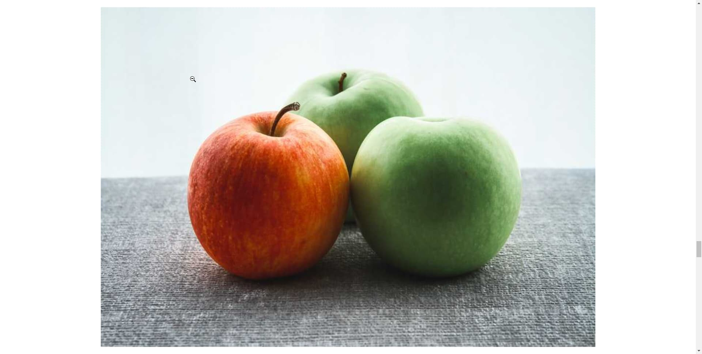
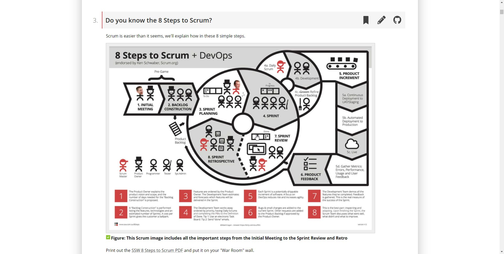
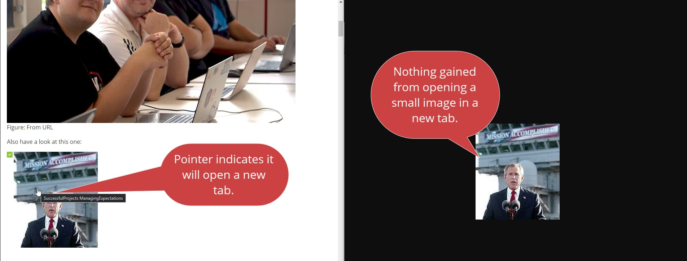
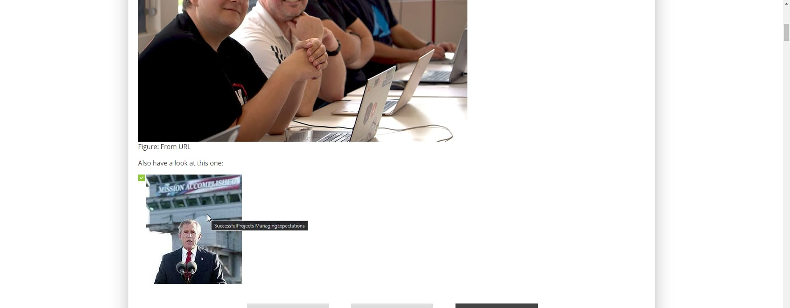

How users can interact with an image is dependant on the context of the image and the intended user workflow.  Follow these guide lines to help you decide which interaction to use, to give your users the best experience you can.

### 1. Modal Image
Modal Image is the ability to zoom a image in the same page via Modal.  Returning to the normal workflow should be done with a quick click or scroll.  A Modal Image should be indicated by a Magnifying Glass Cursor  when hovering over this image. 

Modal Image should be used when:

  * The image has a larger scale to view, or details that might need to be viewed
  * To maximize accessibility
  * To maintain the user workflow
  * Should be considered the default choice for clickable images

::: good  
  
:::

### 2. New Tab
New Tab opens the image in a new tab by itself at a larger scale. A New Tab should be indicated by a Link Pointer Cursor when hovering over this image.

New Tabs should be used when:

  * It is a manual, instructions or something that should interrupt the current workflow
  * It is meant to be printed
  * It is a very high resolution that you want to give the user access too.
  * It is hosted externally.

::: good  
  
:::

### 3. No Interaction
No interactions means that the image is not clickable. The cursor should not change when hovering over an image with No Interaction.

No interaction should be used when:  

  * The image is close to full scale already
  * The image is more for style and decoration.
  
::: bad  
  
:::

::: good  
  
:::

